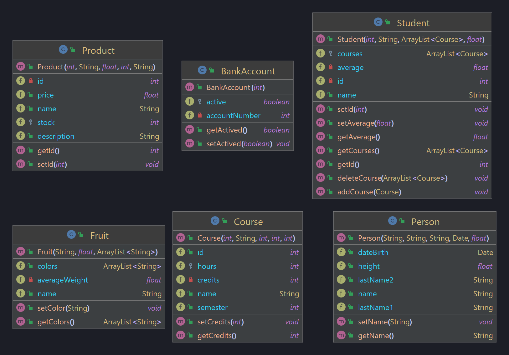

<h1>TALLER PRÁCTICO #1 </h1>

 
<h2>Manejo de Clases y Objetos en Java</h2>

    Taller práctico #1: Manejo de Clases y Objetos en Java
    Semana 1: Paradigma de POO (16H) - Java
    Realizar las clases de los siguientes diagramas, no olvide completar los diagramas a nivel de código, sí usted cree que hace falta algo.
    <ol>
        <li>
            Aparte de las 3 clases, usted debe proponer otras 3 clases donde mezcle tanto atributos públicos, como privados y protegidos.
        </li>
        <li>
            En las 3 clases que usted propone, también debe mezclar métodos tanto públicos, como privados y protegidos.
        </li>
        <li>
            Las 6 clases deben estar en un archivo independiente y cada clase debe ser debidamente documentada.
        </li>
    </ol> 

<h2>SOLUCIÓN</h2>

    Para este caso, se hicieron las 3 clases que se propusieron, añadiendo los constructores que serán ejecutados a la hora de instanciar
    un objeto de estas clases. Sin embargo, se podrían haber hecho métodos getters y setters para cada una de las variables, pero no se es necesario ya que no todas
    las variables son privadas y su acceso es flexible.
         
    En el caso de las 3 clases a crear, se hicieron según lo propuesto en el taller (mezclando modificadores de acceso publico, privado y protegido). Las clases implementadas fueron:
    <ol>
        <li>Student (Estudiante): Representa estudiantes</li>
        <li>Course (Curso): Representa cursos</li>
        <li>Product (Producto): Representa un producto en una tienda en linea</li>
    </ol>
    <h3>DIAGRAMA CLASES </h3>

    